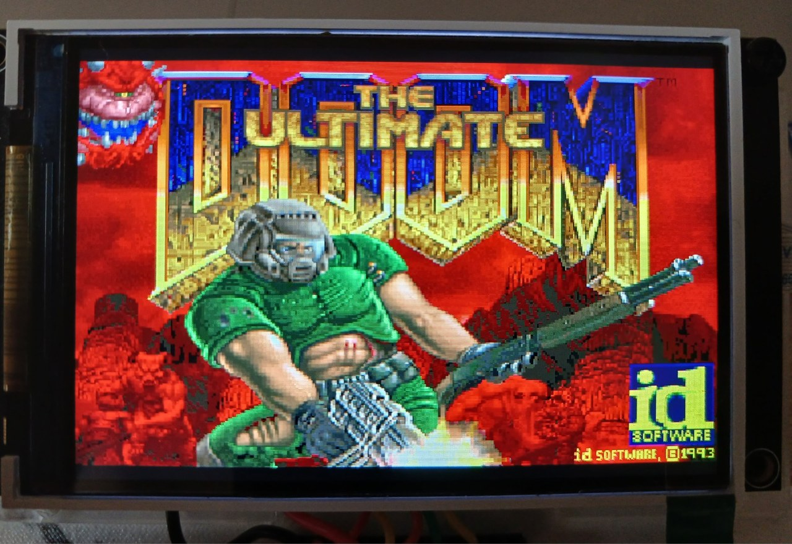
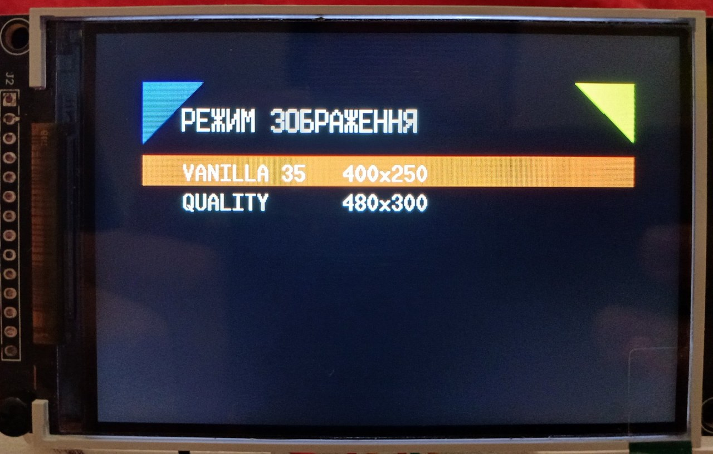
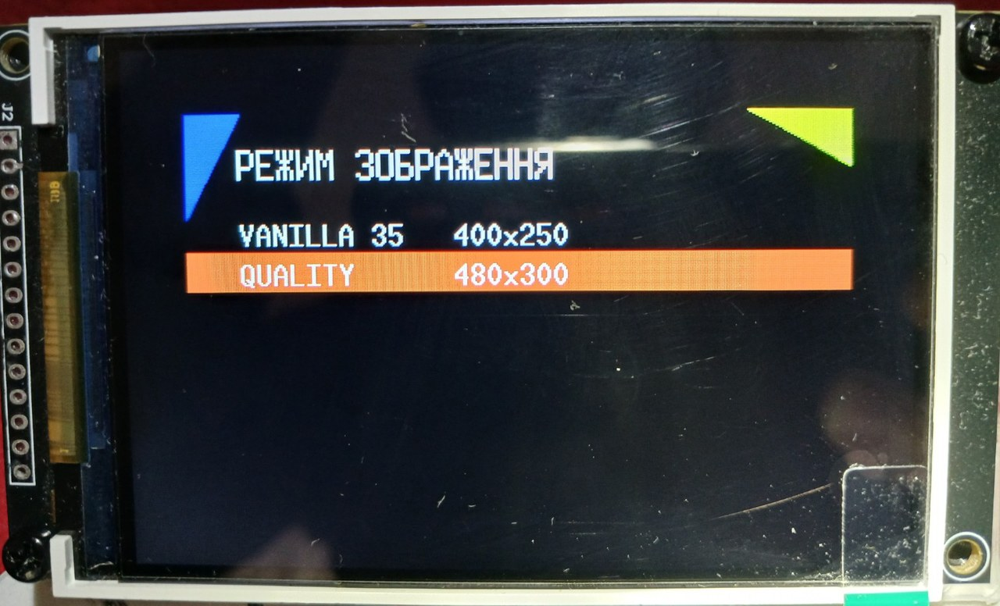
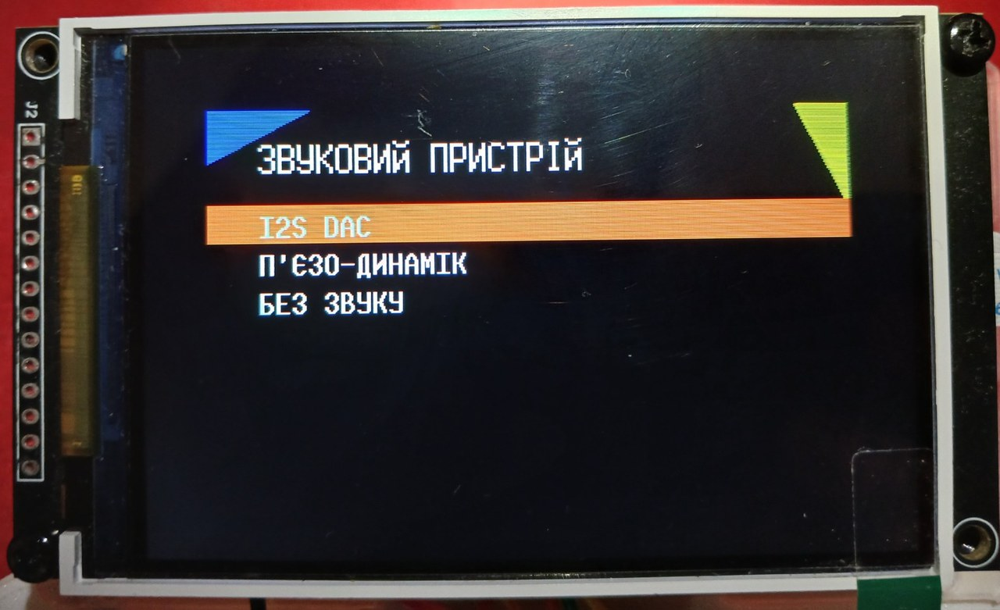
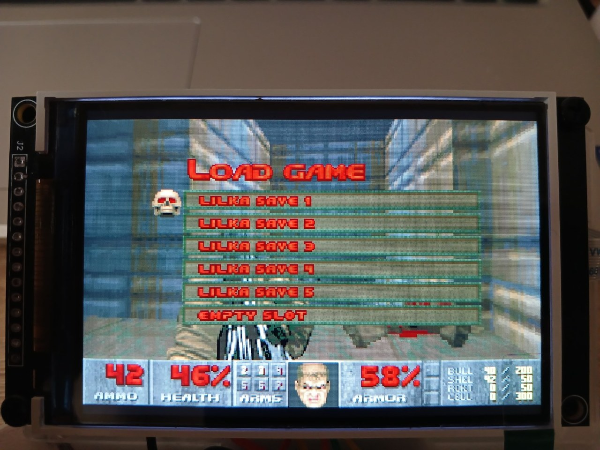
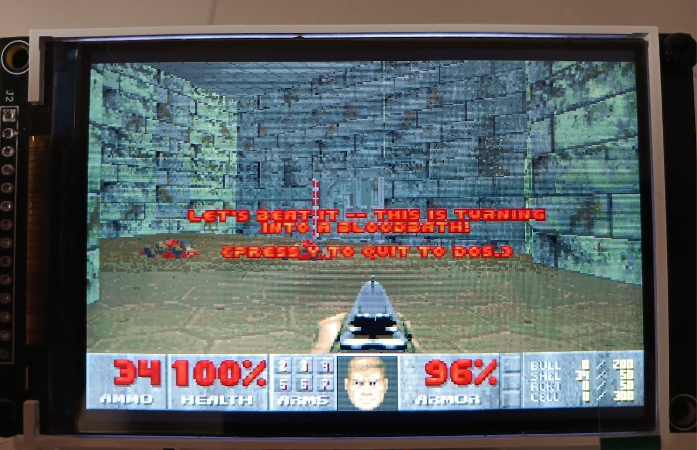
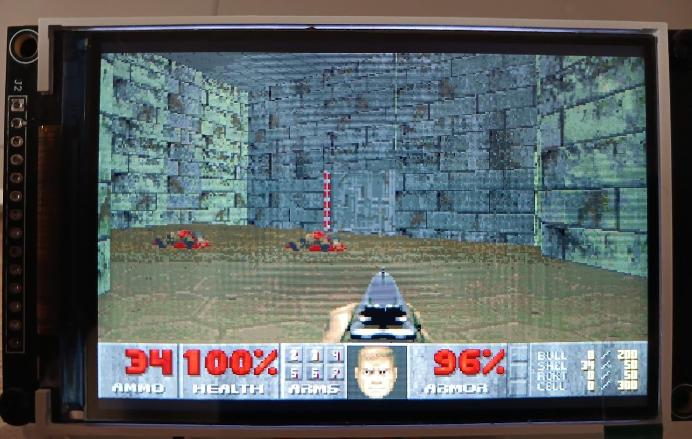

<p align="center">
  
</p>

# Doom for Lilka — ST7796U 3.5″

> **From “I don’t want to squint at a tiny screen” to VANILLA 35.**

This is a finished multiboot Doom port for **Lilka v2 / ESP32-S3 N16R8**, driving an external **3.5″ 480×320 ST7796U TFT** over FFC.

The goal was not a tech demo. The goal was a device you can launch from KeiraOS and simply play: sound, saves, two useful display modes, standalone battery operation, and a clean native exit back to the OS.

## VERIFIED / PASS

- **VANILLA 35 — 400×250, 33–35 FPS**;
- **QUALITY — 480×300, 25–26 FPS**;
- polling-DMA display transport;
- external-TFT display-mode selection;
- native `lilka::Menu` startup UI;
- `I2S DAC`, `Piezo speaker`, `No sound`;
- gameplay;
- save / load;
- Doom menu;
- boot and play without Serial Monitor;
- battery operation without USB;
- launch from KeiraOS;
- native Doom `Quit` flow;
- **START = YES**, **SELECT = NO**;
- clean reboot back to KeiraOS;
- relaunch Doom again.

## Display modes

| Mode | Geometry | Scaling | Transport | Physical result |
|---|---:|---|---|---:|
| **VANILLA 35** | 400×250, centered `x=40, y=35` | exact 5:4 | polling DMA, 4000 B chunk | **33–35 FPS** |
| **QUALITY** | 480×300, `x=0, y=10` | exact 3:2 | polling DMA, 2880 B chunk | **25–26 FPS** |

### VANILLA 35

The native 320×200 Doom framebuffer is expanded to 400×250 using an exact 5:4 nearest-neighbor path. This is the performance mode and the preferred way to stay close to the classic ~35 Hz Doom experience.

<p align="center">
  
</p>

### QUALITY

320×200 is expanded to 480×300 using an exact 3:2 path. It uses the full 480-pixel panel width and leaves 10-pixel black bars at the top and bottom of the 480×320 display.

<p align="center">
  
</p>

## System requirements — verified configuration

- **3.5″ 480×320 TFT with ST7796U/ST7796S controller**;
- **14-pin FFC display interface**;
- **ESP32-S3 N16R8**;
- best physically verified experience: **Lilka v2 by Anderson**;
- SD card;
- legally obtained Doom WAD;
- a small but healthy amount of technical stubbornness.

> **Clock note:** the FFC/ST7796U hardware path has been physically validated up to **125 MHz** at the KeiraOS system level. The final Doom release source deliberately uses **80 MHz bulk SPI**, which is the Doom configuration that passed physical regression.

## External ST7796U wiring

Final source-tree mapping:

| TFT signal | Lilka / ESP32-S3 |
|---|---|
| SCK | GPIO12 |
| MOSI | GPIO14 |
| CS | GPIO48 |
| DC | RX / GPIO44 |
| RST | GPIO47 |
| MISO | not used |
| BL | external 5 V; firmware does not drive BL |

> The historical file name `external_ili9488.*` is intentionally preserved. The backend is ST7796U; renaming was deferred to avoid introducing release-time regressions.

## Startup UI

Display and sound selection use native `lilka::Menu` rendered on the external ST7796U.

<p align="center">
  
</p>

Available sound devices:

- **I2S DAC**;
- **Piezo speaker**;
- **No sound**.

## Controls

| Lilka | Doom |
|---|---|
| D-pad | movement / turning |
| A | FIRE |
| B | USE |
| C | automap / TAB |
| D | next weapon |
| SELECT | ESC / menu / cancel |
| START | ENTER / confirm |

The startup Lilka menus accept the native **A** activation button and **START**.

## Save / Load

Save/load behavior passed final physical regression.

<p align="center">
  
</p>

## Exit From Hell

We did not invent a new exit screen. Doom already had a perfectly good door.

The original flow:

`Quit Game` → `Do you wanna exit to DOS? Y/N`

maps naturally to Lilka:

- **START → Y → exit to KeiraOS**;
- **SELECT → N → cancel and return to Doom**.

<p align="center">
  
</p>

The backend uses the already-validated KeiraOS OTA0 reboot path. No physical RESET is required.

## Quick start

This project builds a **multiboot binary**. Do not flash it over KeiraOS as the main firmware.

1. Open the project in VS Code / PlatformIO.
2. Build:

```bash
pio run -e v2
```

3. `move_firmware.py` copies the built firmware to the project root as `doom.bin`.
4. Put `doom.bin` and a WAD in the same SD folder, for example:

```text
/apps/doom/doom.bin
/apps/doom/doom.wad
```

5. Boot normal KeiraOS and launch `doom.bin` through multiboot / launcher.
6. Select display mode.
7. Select sound device.
8. Play Doom.

Doom searches for `doom*.wad` in the same SD directory from which `doom.bin` was launched.

## Gallery

<p align="center">
  
</p>

Full gallery: **[docs/GALLERY_EN.md](docs/GALLERY_EN.md)**
Development story: **[docs/HOW_IT_WAS_EN.md](docs/HOW_IT_WAS_EN.md)**
Release technical canon: **[docs/TECHNICAL_NOTES.md](docs/TECHNICAL_NOTES.md)**

## WAD / game data

WAD files are **not included and must not be committed to this repository**. Use legally obtained game data. See [WAD_ASSETS.md](WAD_ASSETS.md).


## Credits / Upstream

This release stands on work that came before it:

- **[@And3rson](https://github.com/and3rson)** — Lilka and the Lilka ecosystem;
- **[Lilka v2 documentation](https://docs.lilka.dev/uk/latest/)**;
- **[lilka-dev/doom_port](https://github.com/lilka-dev/doom_port)** — original Lilka Doom proof-of-concept / porting work;
- **[@ozkl](https://github.com/ozkl)** — upstream **[DoomGeneric](https://github.com/ozkl/doomgeneric)**.

Full attribution: **[CREDITS.md](CREDITS.md)**.

## License / notice

This is an unofficial port package and is not affiliated with or endorsed by id Software, Bethesda, Microsoft, or any other rights holder.

See `LICENSE`, `COPYING`, `NOTICE.md`, and the license files under `lib/doomgeneric`.

---

**At some point we stopped testing Doom and noticed we were simply playing it. That’s when we knew it was done.**
