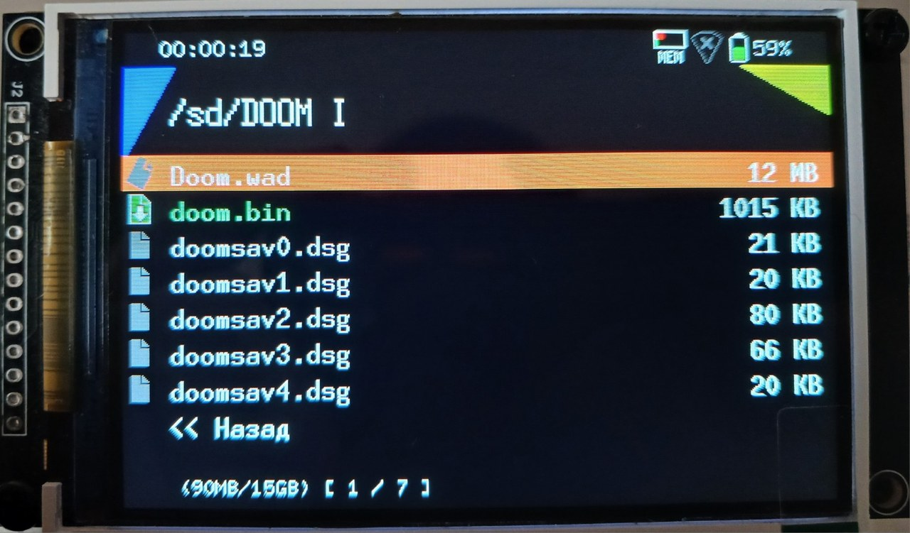
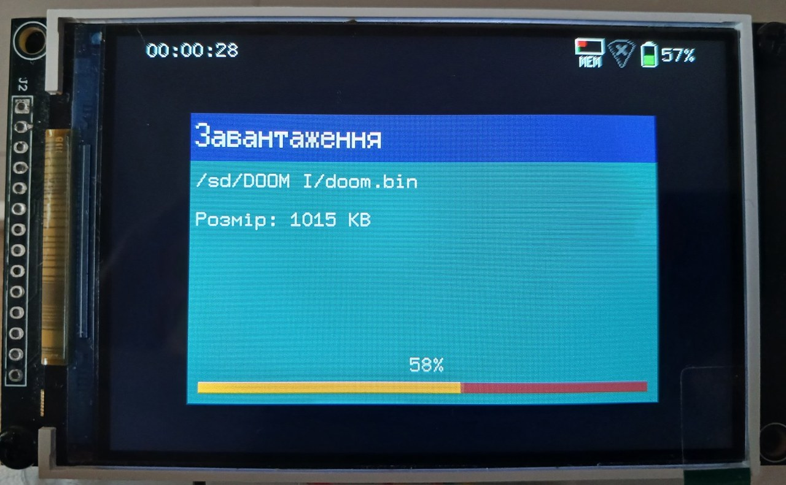
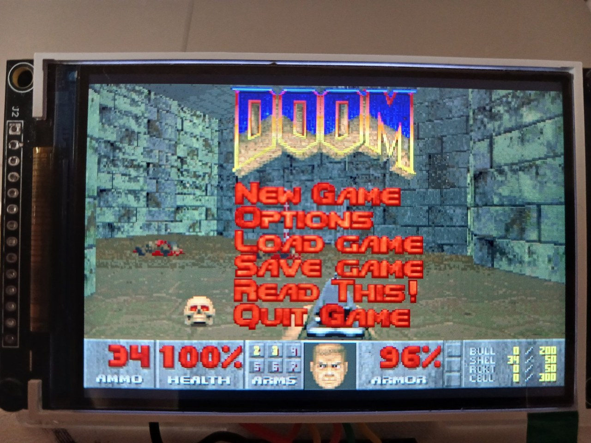
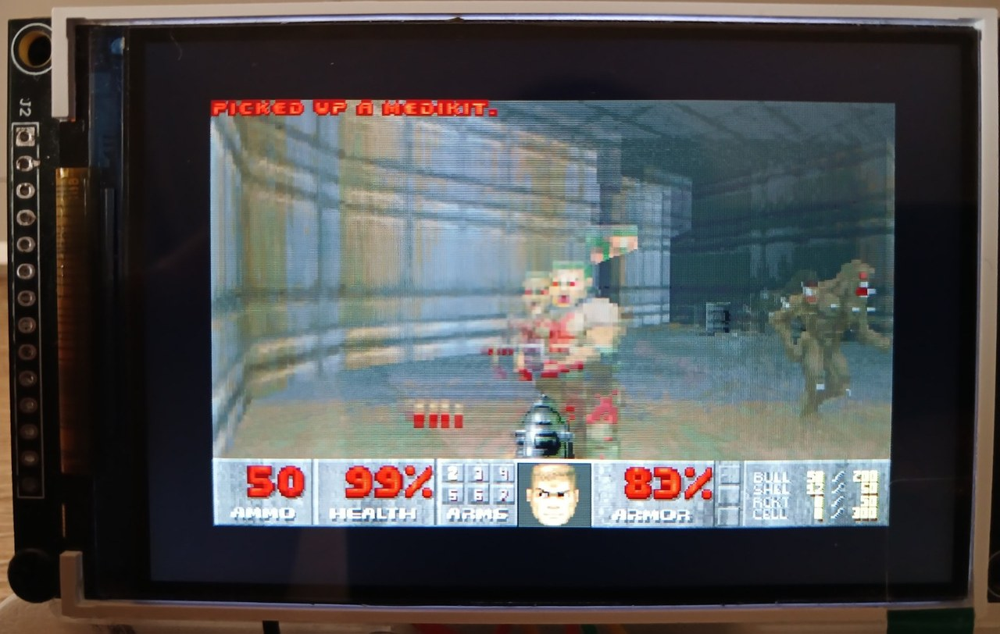
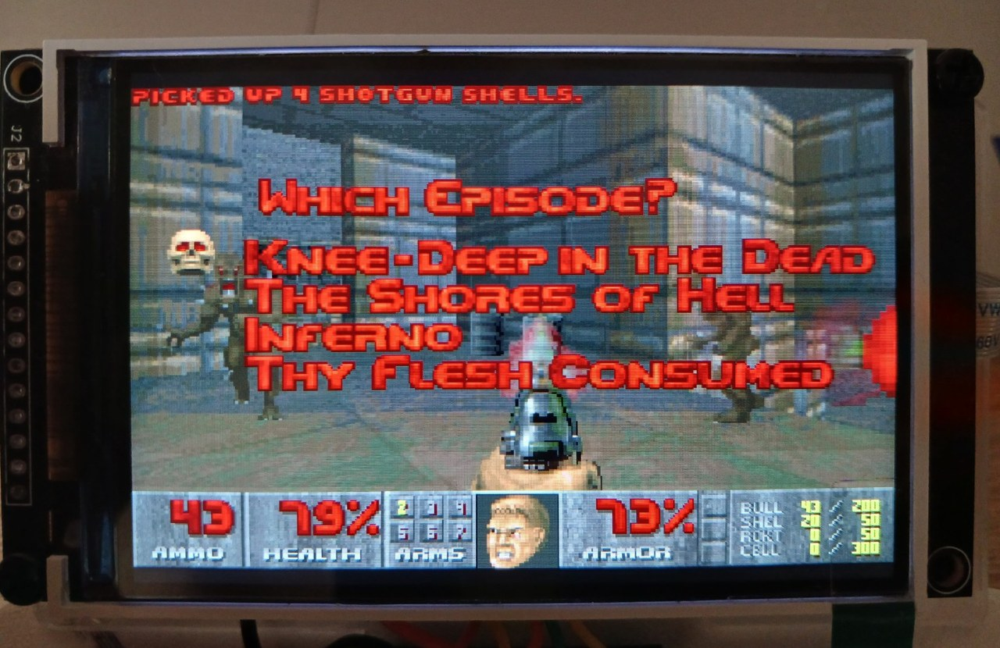
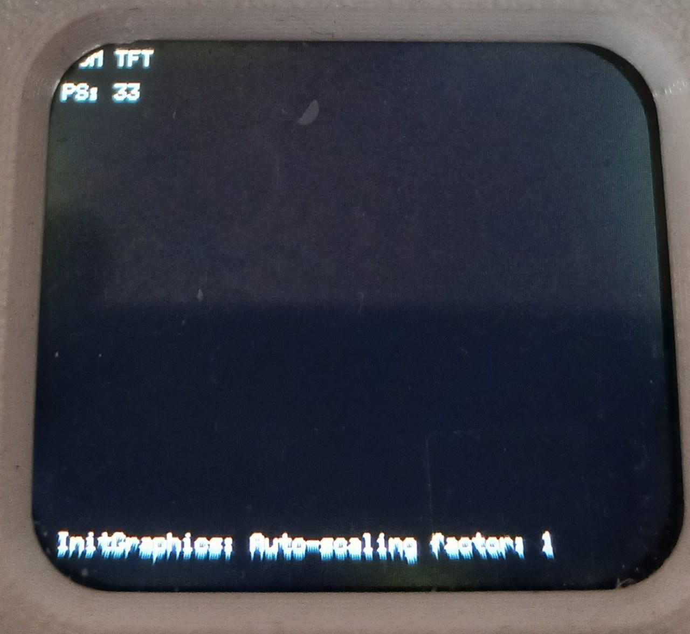
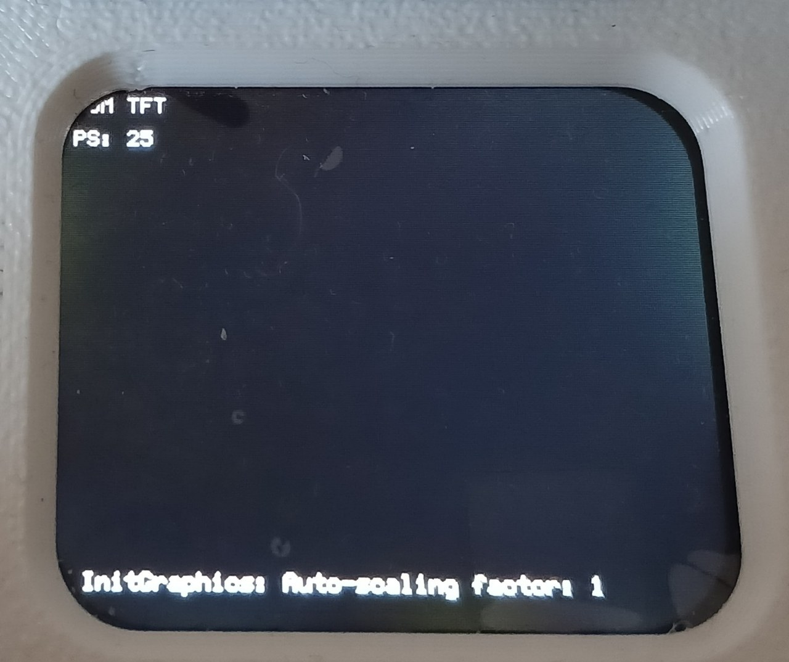

# Gallery — Doom for Lilka / ST7796U 3.5″

## KeiraOS → Doom

<table>
<tr>
<td width="50%"> <b>KeiraOS file manager.</b> `doom.bin`, WAD and saves on SD.</td>
<td width="50%"> <b>Multiboot.</b> Loading `doom.bin` from KeiraOS.</td>
</tr>
</table>

## Startup UI

<table>
<tr>
<td width="50%"> <b>VANILLA 35 — 400×250.</b></td>
<td width="50%"> <b>QUALITY — 480×300.</b></td>
</tr>
<tr>
<td colspan="2"> <b>Native Lilka sound menu.</b> I2S DAC / Piezo / No sound.</td>
</tr>
</table>

## Doom

<table>
<tr>
<td width="50%"> <b>The Ultimate Doom.</b></td>
<td width="50%"> <b>Native Doom main menu.</b></td>
</tr>
<tr>
<td width="50%"> <b>Gameplay.</b></td>
<td width="50%"> <b>Gameplay / combat.</b></td>
</tr>
<tr>
<td width="50%"> <b>Episode selection.</b></td>
<td width="50%"> <b>Save / Load.</b></td>
</tr>
<tr>
<td colspan="2"> <b>Exit From Hell.</b> START = Yes, SELECT = No.</td>
</tr>
</table>

## Lab telemetry

<table>
<tr>
<td width="50%"> <b>VANILLA 35 telemetry:</b> 33 FPS.</td>
<td width="50%"> <b>QUALITY telemetry:</b> 25 FPS.</td>
</tr>
</table>

Full story: [HOW_IT_WAS_EN.md](HOW_IT_WAS_EN.md)
